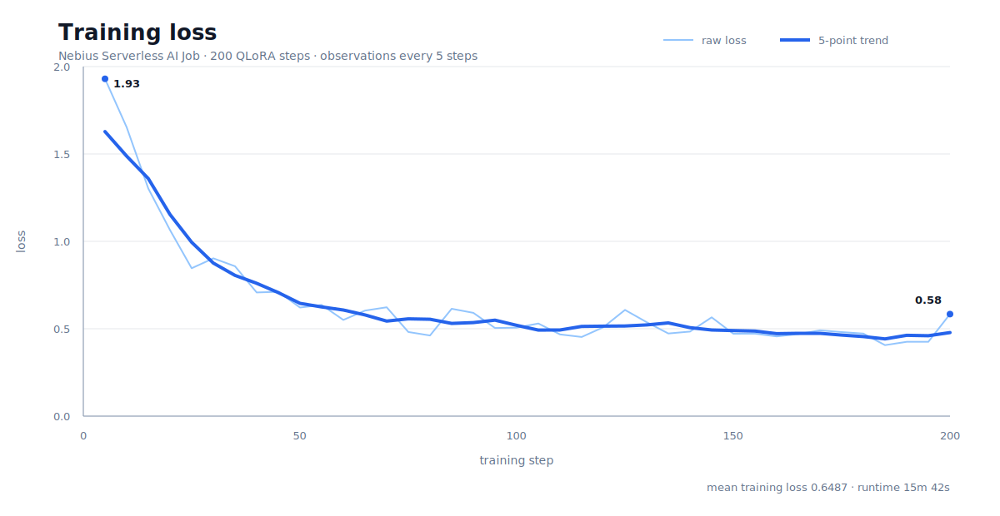
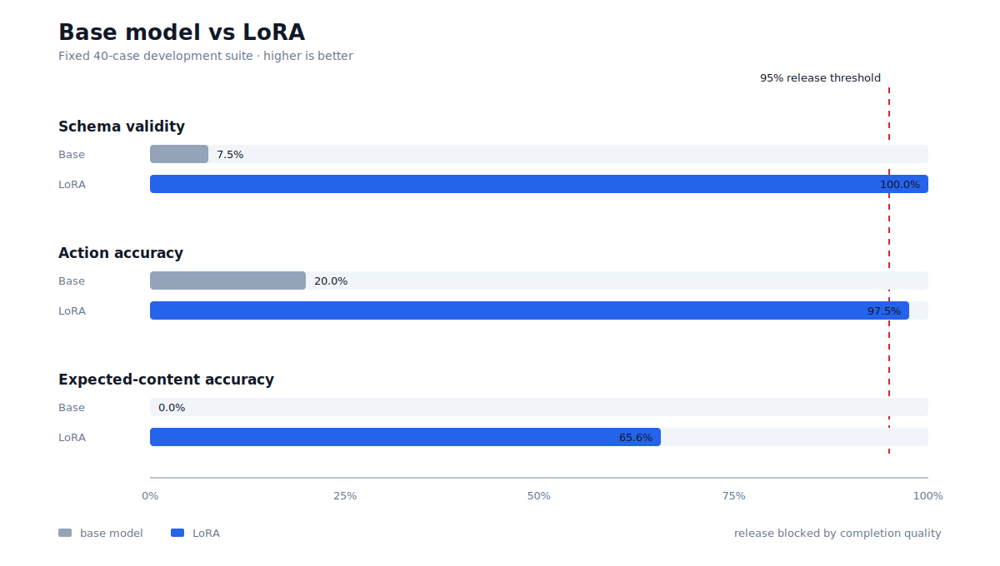
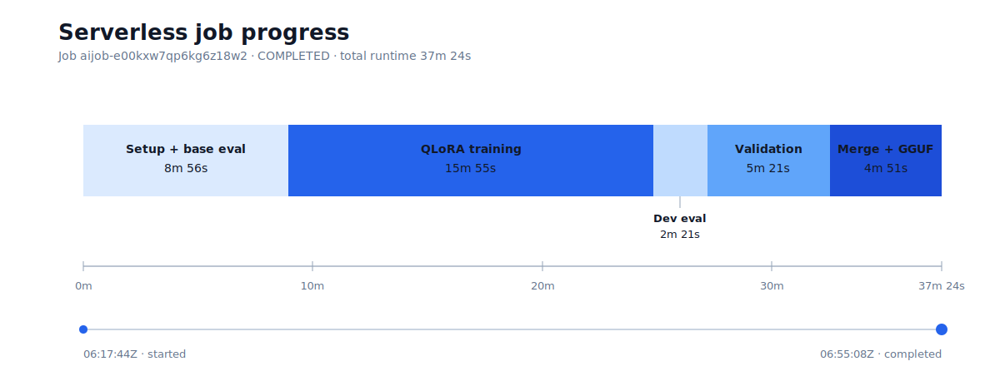

# Tiny Interjection Model Alpha

[Published Update](https://jeremysoojk.substack.com/p/tiny-interjection-model) | [Model](https://huggingface.co/jeremysoojk/tiny-interjection-model-alpha) | [Data](https://huggingface.co/datasets/jeremysoojk/tiny-interjection-model-alpha) | [Repo](https://github.com/Jiply/tiny-interjection-model-alpha)

## The Idea

What's more likely: 8 billion people stop interrupting, pausing, and changing their minds mid-sentence, or AI learns that's how humans communicate? The answer seems obvious.

Tiny Interjection Model Alpha (TIM) explores a small floor-control model for typed chat. Given a timestamped event stream, the model decides whether an assistant should wait, respond, interject, or continue.

```text
<act>wait|respond|interject|continue</act>
<msg>optional assistant message</msg>
<done/>
```

The repository contains a reproducible data pipeline, Qwen3 4B QLoRA training and evaluation code, a FastAPI decision endpoint, and a local `llama.cpp` runtime.

## Challenge status

This project is prepared for the Nebius Serverless AI Builders Challenge. The full QLoRA, evaluation, merge, and GGUF pipeline completed as Nebius Serverless AI Job `aijob-e00kxw7qp6kg6z18w2` in 37m 24s. Model quality and infrastructure completion are reported separately: the job completed, but the adapter did not pass the completion-quality release gate.

The challenge also requires a public repository, proof of execution, and a technical blog post. The public post is [Tiny Interjection Model](https://jeremysoojk.substack.com/p/tiny-interjection-model); the walkthrough video remains an optional submission task.

## Architecture

1. Generate synthetic typed-chat candidates with Qwen3.5 through DigitalOcean Serverless Inference.
2. Validate schema, semantics, balance, duplicates, and prompt diversity locally.
3. Package approved rows as deterministic Hugging Face dataset splits.
4. Fine-tune `Qwen/Qwen3-4B-Instruct-2507` with QLoRA in a Nebius Serverless AI Job.
5. Evaluate against the fixed 40-case DoubleTextBench development suite and a 104-case generated validation suite, then block publication unless the quality gate passes.
6. Merge and quantize every completed experiment for archival; promote only adapters that pass the release gate.

## Nebius training evidence

The first QLoRA experiment ran on a Nebius L40S virtual machine. The redacted console views below preserve the compute configuration and utilization without exposing resource names or identifiers. The final one-off Serverless AI Job completed the full pipeline using an immutable image and dataset revision; exact evidence and measured results are in [docs/experiment-results.md](docs/experiment-results.md).








Raw responses, rejected candidates, datasets, checkpoints, adapters, reports, and model binaries are generated artifacts and are intentionally excluded from Git.

Measured provenance and non-sensitive result summaries are retained in [docs/experiment-results.md](docs/experiment-results.md), including the DigitalOcean Serverless Inference teacher run and the completed Nebius Serverless AI Job.

Ignored does not mean disposable. Training datasets, adapters, evaluation reports, and GGUF executables are retained until their Hugging Face uploads and hashes are verified. `make clean` removes caches only and never removes anything under `data/`, `adapters/`, or `runs/`.

The retained model artifact hashes and pinned public base source are recorded in [docs/artifact-manifest.json](docs/artifact-manifest.json). A filename ending in `.partial` is never accepted as an executable model.

Reviewed experimental adapter artifacts are published at immutable Hugging Face revision [`d81bde1810133a06f6aa61a3e79cf367203b3c4e`](https://huggingface.co/jeremysoojk/tiny-interjection-model-alpha/tree/d81bde1810133a06f6aa61a3e79cf367203b3c4e). That model repository preserves the earlier Nebius L40S virtual-machine adapter and its evaluation reports. The later credentialless Serverless proof run did not upload its ephemeral model outputs.

## Local setup

Python 3.11 is recommended.

```bash
make setup
make test
```

Generate the deterministic offline dataset:

```bash
make data
```

This writes training, validation, and DoubleTextBench JSONL files under `data/processed/`.

## Teacher data

The canonical 702-row synthetic dataset is published through Hugging Face. Its 598 training and 104 validation rows are the retained package used by the hosted reference adapter and recorded by the completed Nebius Serverless job. Use its public repository ID and single immutable revision to reproduce a run.

Download published train and validation splits at a pinned revision:

```bash
hf download \
  jeremysoojk/tiny-interjection-model-alpha \
  --repo-type dataset \
  --revision 7eab2028563f17bae3a66c392d0dd9bbf1fe389f \
  --local-dir data/processed/qwen35-hf
```

Reproduce the hosted reference adapter's 300-step training procedure from pinned model and dataset inputs:

```bash
make setup
hf download \
  Qwen/Qwen3-4B-Instruct-2507 \
  --revision cdbee75f17c01a7cc42f958dc650907174af0554 \
  --local-dir data/processed/qwen3-4b-instruct-2507
.venv/bin/python -m interaction_models.train \
  --model-name data/processed/qwen3-4b-instruct-2507 \
  --train-file data/processed/qwen35-hf/data/train.jsonl \
  --output-dir runs/reference-reproduction \
  --adapter-dir adapters/reference-reproduction \
  --max-steps 300
```

CUDA kernels and dependency updates can prevent bit-for-bit identical weights, but the pinned data, base model, code, and hyperparameters reproduce the training procedure and evaluation target. The published adapter and recorded hashes provide the immutable reference artifact.

The hosted teacher-generation path requires an authenticated `doctl` installation. It creates a new synthetic dataset and does not read private conversations or personal data.

```bash
cd digital-ocean
make generate COUNT=100
make package COUNT=100
make verify-package
make upload HF_DATASET_REPO=ORGANIZATION/DATASET
```

The upload target uses the official Hugging Face CLI. Set `HF_CLI` only when the executable is not named `hf`.

For a newly generated dataset, review the card and samples before making its repository public:

```bash
hf repos settings ORGANIZATION/DATASET --public
```

See [digital-ocean/README.md](digital-ocean/README.md) for details.

## Training and evaluation

The generic CUDA path is:

```bash
make data
make eval-base
make train
make eval-adapter
make verify
```

Defaults:

- base model: `Qwen/Qwen3-4B-Instruct-2507`
- quantization: 4-bit NF4
- LoRA rank and alpha: `16`
- maximum sequence length: `4096`
- quality gate: 100% schema validity, 95% action accuracy, 95% expected-content accuracy, and no premature response on holdout `wait` cases

## Nebius Serverless AI Job

Build the Linux GPU image and publish it to a registry accessible by Nebius:

```bash
docker build --platform linux/amd64 -t REGISTRY/tiny-interjection-model-alpha:VERSION .
docker push REGISTRY/tiny-interjection-model-alpha:VERSION
```

Store the Hugging Face token in Nebius MysteryBox, then submit the one-off job:

```bash
nebius/submit_job.sh \
  REGISTRY/tiny-interjection-model-alpha:VERSION \
  ORGANIZATION/DATASET \
  DATASET_COMMIT_SHA \
  ORGANIZATION/MODEL \
  HF_SECRET_SELECTOR \
  SUBNET_ID
```

For a public-dataset proof run that does not upload artifacts, use `-` for `HF_SECRET_SELECTOR`. This avoids transferring a Hugging Face credential while preserving training, evaluation, merge, quantization, and Serverless execution evidence.

The completed proof run used this redacted command shape. The historical dataset revision below is the exact training input recorded by the Nebius job.

```bash
nebius/submit_job.sh \
  REGISTRY/tiny-interjection-model-alpha@sha256:284888e80ca9d0e23884c35a10ddd864ebf990f636535d78e3cf9d2244833ee5 \
  jeremysoojk/tiny-interjection-model-alpha \
  f38db36f56efecb46b84854484afa99287401a41 \
  jeremysoojk/tiny-interjection-model-alpha \
  - \
  SUBNET_ID
```

The account-scoped registry namespace and subnet are redacted. Nebius confirms that `f38db36f56efecb46b84854484afa99287401a41` was the completed job's dataset revision. The same retained 702-row package is publicly available in a clean root commit at `7eab2028563f17bae3a66c392d0dd9bbf1fe389f`; use that public revision for new runs.

The submission uses the `gpu-l40s-a` platform with the `1gpu-8vcpu-32gb` preset, a 450 GiB ephemeral disk, 16 GiB shared memory, and a 12-hour timeout. The container downloads an immutable dataset revision, evaluates the base model, trains and evaluates the adapter, applies both quality gates, and creates a Q4 GGUF. Authenticated runs archive the experiment; only a passing adapter is promoted to the model repository root. A failed quality gate is logged separately and does not turn a successfully executed pipeline into a failed infrastructure job.

Authenticated runs can archive a PEFT adapter, base evaluation, adapter evaluation, generated-validation evaluation, and quantized GGUF in a target Hugging Face model repository. The completed proof run was credentialless, so its model outputs were ephemeral; its status and logs remain available through the Nebius CLI.

The measured 200-step Serverless run took 37m 24s, including model downloads, both evaluation suites, training, merge, and quantization. At the planning rate checked on July 10, 2026, that is a compute-only estimate of about `$0.97`, plus ephemeral disk. The settled billed figure may appear later in the Nebius billing export and is tracked separately in [TODO.md](TODO.md).

See [nebius/README.md](nebius/README.md) for setup, monitoring, and security details.

## Demo

Run the explicit heuristic smoke demo without model weights:

```bash
make cli-heuristic
```

Run a trained GGUF base and LoRA adapter with `llama.cpp`:

```bash
make cli-llama \
  LLAMA_CLI=/path/to/llama-cli \
  LLAMA_MODEL=/path/to/base.gguf \
  LLAMA_ADAPTER=/path/to/tim-adapter.gguf
```

To download the pinned public base used with the retained adapter:

```bash
curl -L --fail --retry 5 \
  --output runs/local-llama/Qwen3-4B-Instruct-2507-Q4_K_M.gguf.partial \
  https://huggingface.co/lmstudio-community/Qwen3-4B-Instruct-2507-GGUF/resolve/4edb920b6f14e3b9284d4502a6485103d72cde05/Qwen3-4B-Instruct-2507-Q4_K_M.gguf
```

Keep incomplete downloads suffixed with `.partial` until their full size and hash have been verified, then rename the verified file to remove that suffix.
The expected SHA-256 is `8cdb57cbb880d313736a9bc4e3d3d2485f145b5e19cf33783746e753e82641fc`.

Start the FastAPI service after placing a trained PEFT adapter in `adapters/qwen3-4b-instruct-2507`:

```bash
make serve
```

Then request a decision:

```bash
curl -s http://127.0.0.1:8000/decide \
  -H 'content-type: application/json' \
  -d '{"events":[{"role":"user","text":"can you help write this","dt_ms":0},{"role":"user","text":"make it warmer actually","dt_ms":1300}]}'
```

## Data and security

- Only synthetic or public data belongs in the pipeline.
- Never commit credentials, private data, raw model responses, rejected rows, model weights, or unreviewed cloud logs.
- Hugging Face tokens must be provided at runtime and scoped to the required dataset or model repository.
- Review generated samples before publishing a dataset or changing repository visibility.

## License

Apache-2.0. See [LICENSE](LICENSE).
